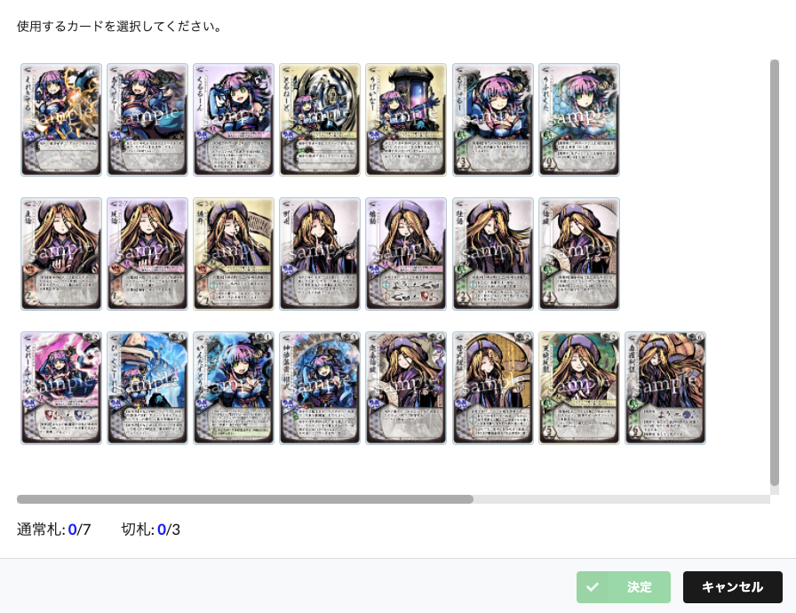

# FuruSimKisekae

ふるしむきせかえ
==============

ふるしむきせかえは、Chrome 拡張で動作します。『桜降る代に決闘を』のカードゲームシミュレータである、 
「ふるよにボードシミュレータ」のデッキ構築画面にカードイラストを表示します。

特徴:
==============

1. 「ふるよにボードシミュレータ」のデッキ構築画面にカードイラストを表示します。
2. デッキ構築画面を少し縦長に調整します。
3. カードイラストは、「ふるよにコモンズ」の画像を表示します。

インストール
==============

1. この GitHub ページの右上 Code - Download Zip
2. FuruSimKisekae-main.zip を解凍
3. 『桜降る代に決闘を』公式サイトの[ゲームルールとFAQ](https://main-bakafire.ssl-lolipop.jp/furuyoni/na/rule.html)ページの中程にある「ふるよにコモンズ」をダウンロード
4. furuyoni_commons_na.zip を解凍
5. furuyoni_commons_na/furuyoni_na/cards フォルダごと、FuruSimKisekae-main/resources フォルダにコピー
6. Chrome - その他のツール - 拡張機能 - デベロッパーモード - オン
7. パッケージ化されていない拡張機能を読み込む - FuruSimKisekae-main.zip を解凍したフォルダを指定

デモ
=============

クレジット:
-----------------

1. 素敵でかわいいカードイラストは、BakaFire Party様ご提供の「ふるよにコモンズ」の画像を利用させていただいております。
2. 「ふるよにボードシミュレータ」への組み込みについて BakaFire様に個別で連絡を行い、許可を頂いております。
3. 『桜降る代に決闘を』について 
    https://main-bakafire.ssl-lolipop.jp/furuyoni/ 
    ふるよにコモンズ/BakaFire,TOKIAME
